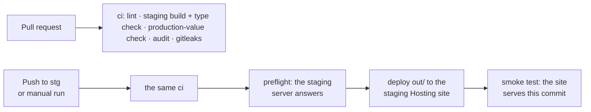

# Staging: setup, CI/CD and deploys

Staging is this console built against **switch-server-v2 on staging** (its own database with
seeded test data), published at **https://switchfood-staging-ops.web.app**. Assign drivers,
cancel orders and try the queue there without touching production.

Nothing here deploys to production. No workflow can: the deploy identity only exists in the
staging project. Production is still `npm run deploy` from your machine, as before.

---

## 1. How it works



- `.github/workflows/ci.yml` runs on every pull request.
- `.github/workflows/deploy-staging.yml` runs on every push to `stg` (and on demand from `stg`).
  It runs the same checks, then deploys **the exact `out/` they built**.
- `.env.staging` (committed, nothing secret) is the staging build's config: the staging server's
  URL and the staging Pusher key. `npm run build:staging` (`scripts/build-staging.mjs`) builds
  with it, then refuses the bundle if it contains a production value (the production API host
  or Pusher key), or if it doesn't contain the staging ones.
- `firebase.json` and `.firebaserc` stay production's. The deploy writes a copy of
  `firebase.json` that names the staging site (`SITE` in the workflow), so both sites always get
  the same headers and URL rules.
- GitHub holds no Google key. The deploy signs in with Workload Identity Federation, which Google
  only accepts from this repository's `stg` branch. `main` is kept for production later.

### What staging uses

| | Staging | Production |
|---|---|---|
| Site | `switchfood-staging-ops.web.app` (project `switchfood-staging`) | `switch-ops.web.app` (project `switch-proj`) |
| Parse server | `https://switchfood-staging.oa.r.appspot.com` (switch-server-v2) | `https://api.switchfood.net` (legacy) |
| Realtime | the staging Pusher app | the production Pusher app |
| Map tiles | OpenFreeMap, same as production | OpenFreeMap |
| Accounts | the seeded ones: `admin`, `ops` (switch-server-v2 `docs/05-staging.md`, step 11) | real staff |
| Data | seeded orders, restaurants and drivers | real ones |

The staging server accepts requests from any origin, so it needs nothing for this site.

---

## 2. Setup (once)

Needs the server's staging set up first (switch-server-v2 `docs/05-staging.md`): this reuses its
Google Cloud project `switchfood-staging` and its `github` identity pool. Also the Google Cloud
CLI, the Firebase CLI (`firebase login`) and the GitHub CLI.

Set these once per terminal, in `switch-ops/`:

```bash
export PROJECT_ID=switchfood-staging
export GITHUB_REPO=switchdevv/switch-ops
export SITE=switchfood-staging-ops
export PROJECT_NUMBER=$(gcloud projects describe "$PROJECT_ID" --format='value(projectNumber)')
export DEPLOY_SA="github-hosting-deployer@$PROJECT_ID.iam.gserviceaccount.com"
```

### Step 1. The Hosting site

```bash
firebase hosting:sites:create "$SITE" --project "$PROJECT_ID"
```

Site names are global across Firebase. If this one is taken, pick another and put it in `SITE`
in `.github/workflows/deploy-staging.yml` (and in this guide).

### Step 2. The deploy identity

One service account deploys both web dashboards (switch-ops and switch-finance). Create it once;
if switch-finance's setup already did (`gcloud iam service-accounts describe "$DEPLOY_SA"
--project="$PROJECT_ID"` finds it), skip to the provider.

```bash
gcloud iam service-accounts create github-hosting-deployer --project="$PROJECT_ID" \
  --display-name="GitHub deploys (web dashboards, Firebase Hosting)"
gcloud projects add-iam-policy-binding "$PROJECT_ID" --condition=None \
  --member="serviceAccount:$DEPLOY_SA" --role=roles/firebasehosting.admin
```

It may only publish Firebase Hosting sites of the staging project: no App Engine, no secrets, no
database, nothing in production.

This repository's provider in the existing `github` pool, which Google only lets this
repository's `stg` branch use, and its right to act as the service account:

```bash
gcloud iam workload-identity-pools providers create-oidc switch-ops \
  --project="$PROJECT_ID" --location=global --workload-identity-pool=github \
  --display-name="switch-ops" --issuer-uri="https://token.actions.githubusercontent.com" \
  --attribute-mapping="google.subject=assertion.sub,attribute.repository=assertion.repository,attribute.ref=assertion.ref" \
  --attribute-condition="assertion.repository == '$GITHUB_REPO' && assertion.ref == 'refs/heads/stg'"

gcloud iam service-accounts add-iam-policy-binding "$DEPLOY_SA" --project="$PROJECT_ID" \
  --role=roles/iam.workloadIdentityUser \
  --member="principalSet://iam.googleapis.com/projects/$PROJECT_NUMBER/locations/global/workloadIdentityPools/github/attribute.repository/$GITHUB_REPO"
```

### Step 3. GitHub repository variables

```bash
gh variable set GCP_PROJECT_ID --repo "$GITHUB_REPO" --body "$PROJECT_ID"
gh variable set GCP_DEPLOY_SA --repo "$GITHUB_REPO" --body "$DEPLOY_SA"
gh variable set GCP_WIF_PROVIDER --repo "$GITHUB_REPO" \
  --body "projects/$PROJECT_NUMBER/locations/global/workloadIdentityPools/github/providers/switch-ops"
```

Variables, not secrets: none of them grants anything without the federation of step 2.

### Step 4. First push, first deploy

```bash
npm run lint && npm run build:staging   # what ci runs, locally
git switch -c stg                       # from an up-to-date main
git add -A
git status                              # .env.staging must be listed, .env.local must NOT
git commit -m "Staging CI/CD"
git push -u origin stg
gh run watch --repo "$GITHUB_REPO"
```

When it is green, open https://switchfood-staging-ops.web.app and sign in as `ops` or `admin`
with the staging seed password. In DevTools → Network, requests go to
`switchfood-staging.oa.r.appspot.com`, never `api.switchfood.net`.

`npm run build:staging` leaves a staging bundle in `out/`. `npm run deploy` rebuilds before it
publishes, so that's harmless; never run a bare `firebase deploy` after a staging build.

---

## Everyday use

| Task | How |
|---|---|
| Deploy | Merge or push to `stg` (pull requests into `stg`). |
| Redeploy without a change | Actions → deploy-staging → Run workflow on `stg`, or `gh workflow run deploy-staging --repo switchdevv/switch-ops --ref stg`. |
| What is live | `curl https://switchfood-staging-ops.web.app/version.json` (commit and run). |
| Change the staging config | Edit `.env.staging`, pull request into `stg`. |
| Roll back | Firebase console → project `switchfood-staging` → Hosting → `switchfood-staging-ops` → Release history → ⋮ → Roll back. Or revert the change on `stg`. |
| Build exactly like ci | `npm run build:staging` |

A server change the console needs goes to switch-server-v2's `stg` first, then this one.

---

## Troubleshooting

| Symptom | Cause and fix |
|---|---|
| `Set these repository variables` | Step 3. |
| auth step: `unauthorized_client` / rejected by the attribute condition | The run is not on `stg`, or `$GITHUB_REPO` in the provider's condition doesn't match the repository (step 2). |
| auth step: `iam.serviceAccounts.getAccessToken` denied | The `workloadIdentityUser` binding of step 2 is missing. New bindings can take a few minutes. |
| deploy: `missing the following required permissions` | The `firebasehosting.admin` binding of step 2. |
| deploy: the site doesn't exist, or belongs to another project | Step 1, and `SITE` in the workflow. |
| build: `contains the production value` | Something inlined a production value into the staging bundle: a `NEXT_PUBLIC_*` exported in your shell (it wins over `.env.staging`), or a hardcoded URL or key in `src/`. |
| build: `doesn't contain NEXT_PUBLIC_…` | The key isn't used by the code any more (remove it from `.env.staging`), or the build didn't read the file. |
| preflight: the staging server never answered `/health` | switch-server-v2's staging is down or mid-deploy (see its Actions), or `NEXT_PUBLIC_PARSE_SERVER_URL` is wrong. |
| Sign-in refused | Use a seeded staff account. Other staff need `opsAccess`, which `admin` grants on `/access` (switch-server-v2 has `setOpsAccess`). |
| An open tab keeps the previous build | Pages are network-first in the service worker: a reload gets the new deploy. |
